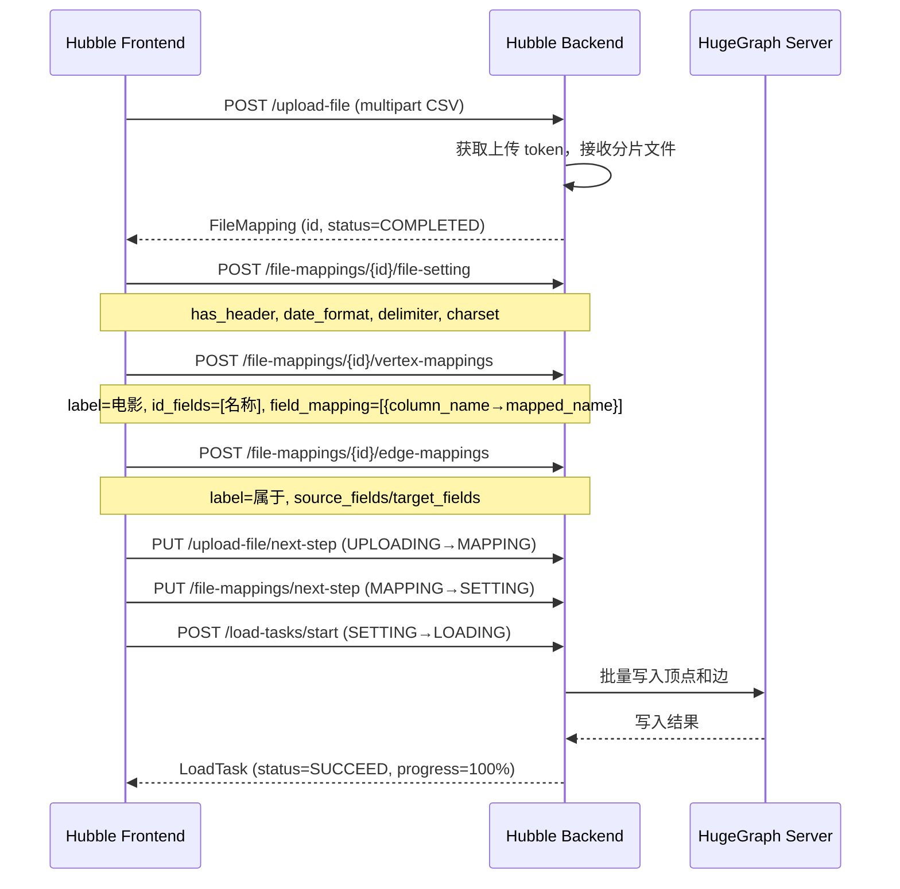

# Hubble V2.0 收尾发版 — 方案·实施·测试

---

## 第一部分: 方案设计

### 1.1. 背景

Apache HugeGraph Hubble 是 HugeGraph 图数据库的可视化管理平台，当前版本为 V2.0（对应 HugeGraph Toolchain 1.8.0 发版周期）。Hubble 模块首次以完整形态（Spring Boot 后端 + React 前端）集成到 toolchain 仓库中。

在正式发版前，需要完成核心功能验证、ASF 合规审计、以及补充交付物（LICENSE/NOTICE/DISCLAIMER/内置数据集）。本文定位为 **本地验证报告 + release gate 收尾方案**，最终是否进入 1.8.0 发版流程，仍取决于 PR 状态闭环和最终 source/binary artifact 合规复验。

### 1.2. 目标

| 目标 | 说明 |
|------|------|
| **功能可用性** | 确保本地编译、二进制打包、启动/停止全链路正常，数据读写和图算法 API 基本可用 |
| **ASF 合规** | 满足 Apache Software Foundation 的 Source Release 规范：无二进制文件泄漏、License 头完整、法律文件齐全。最终合规以 source/binary artifact 扫描为准，而非仅看工作区 ignore 规则 |
| **国际化** | 中/英文翻译 key 完全对称，无缺失或空值；`2026-06-03` 已补做 runtime smoke：默认中文页与英文关键路由无 raw key，但英文按钮 / 表格仍发现溢出风险，后端错误消息策略需明确记录 |
| **用户友好** | 内置数据集可被跟踪和管理；README 发版前补齐编译步骤、启动方式、Server 依赖版本、数据集导入说明（含 `has_header`/`date_format` 常见问题） |

### 1.3. 范围

**In-Scope:**
- 全链路编译验证（client → loader → hubble-be → hubble-fe）
- 二进制包打包和结构验证（tar.gz 解压后目录完整性）
- 启动/停止脚本验证和 actuator 健康检查
- 数据导入功能端到端测试（CSV → 顶点/边映射 → 加载执行 → Gremlin 查询可视化）
- 图算法 shortestPath API 功能测试和异常处理验证
- .gitignore 二进制排除、License 头检查、法律文件（LICENSE/NOTICE/DISCLAIMER）补全
- 前端 i18n 中英文 key 对称性验证，以及 runtime smoke 清单定义
- 内置数据集 git 可跟踪性修复和 README 数据集说明 gate 定义

**Out-of-Scope:**
- Hubble 功能 Bug 修复（如 shortestPath graph_view=null）
- 前端 UI 功能增强
- Cypher 查询支持
- 性能压测和优化

### 1.4. 系统架构

**Toolchain 整体结构:**

```
┌─────────────────────────────────────────────────────────┐
│                  HugeGraph Toolchain                     │
├──────────┬──────────┬──────────┬────────────────────────┤
│  client  │  loader  │  hubble  │   dataset/             │
│  (Java)  │  (Java)  │ (Spring  │   (内置数据集 .zip)     │
│          │          │  Boot +  │                        │
│          │          │  React)  │                        │
└──────────┴──────────┴──────────┴────────────────────────┘
```

**Hubble 内部模块:**

```
hugegraph-hubble/
├── hubble-be/          # Spring Boot 后端 (Java 8)
│   ├── controller/     # REST API (/api/v1.2/)
│   ├── service/        # 业务逻辑层
│   ├── entity/         # 数据模型 (JobManager, FileMapping, LoadTask)
│   └── handler/        # 异步加载执行器 (LoadTaskExecutor)
├── hubble-fe/          # React 前端 (Node V16 + yarn 1.x)
│   ├── src/            # TypeScript 源码
│   └── build/          # 编译产物 (git ignored)
├── hubble-dist/        # 二进制打包模块
│   └── assembly/       # Maven Assembly 描述符
└── hubble-parent/      # 父 POM
```

**数据导入管线:**



### 1.5. 关键设计决策

**决策一: 二进制 vs 源码发布**

| 发布形式 | 说明 |
|---------|------|
| **Source Release（正式）** | ASF 官方发布形式，不含任何二进制文件。需排除 `node/`（Node 运行时 ELF 二进制）、`node_modules/`、`build/`、`target/` |
| **Binary Distribution（附赠）** | `.tar.gz` 打包，包含前端编译产物 `ui/`（JavaScript 文本文件），为用户提供开箱即用体验 |
| **处理方式** | `.gitignore` / `.licenserc.yaml` 作为工作区合规证据；`assembly.xml` 正确引用项目根目录的法律文件；`!dataset/*.zip` 白名单规则允许数据集跟踪；最终仍以 source tarball / binary tarball 扫描为准 |

**决策二: hubble-fe/node/ 的处理**

`hubble-fe/node/` 由 `frontend-maven-plugin` 自动下载，包含 Node V16.20.2 ELF 二进制运行时。这是 **二进制文件**，绝不能出现在 ASF Source Release 中。

- **.gitignore 目标规则**: `/hugegraph-hubble/hubble-fe/node/` — 覆盖整个 node 目录（不仅是 node_modules）；当前工作区已见此改动，仍需确认同步到 PR
- **.licenserc.yaml 目标规则**: 添加 `hugegraph-hubble/hubble-fe/node/**` 排除规则；当前工作区已见此改动，仍需确认同步到 PR
- **核心区别**: `node/` 是二进制运行时（ELF），`node_modules/` 是 JavaScript 文本包，两者都需要 ignore，但 `node/` 对 ASF 合规影响更大

**决策三: hubble-be.jar 非 Fat Jar**

`java -jar hubble-be.jar` 无法启动 — 这是 **预期行为**，非 Bug。Manifest 中虽有 `Main-Class` 和 `Class-Path`，但类路径引用存在 `lib/lib/` 双重嵌套问题。正确的启动方式是通过 `bin/start-hubble.sh` 脚本构建 `-cp lib/*`。

### 1.6. 代码改动清单

| 文件 | 改动类型 | 原因 | 同步状态 |
|------|---------|------|----------|
| `.gitignore` | 修改 | `node/` 路径修正 (全目录覆盖) + `!dataset/*.zip` 白名单 | 工作区已更新，需确认同步到 PR #632 |
| `.licenserc.yaml` | 修改 | 添加 `node/**`、`node_modules/**`、`build/**` 排除规则 | 工作区已更新，需确认同步到 PR #632 |
| `assembly.xml` | 修改 | 新增 fileSet 从项目根目录获取 LICENSE/NOTICE/DISCLAIMER | 工作区已更新，本地已验证打包结构，仍需确认同步到 PR #632 |
| `DISCLAIMER` | 新建 | TLP 版本免责声明（ASF 发版强制要求） | 工作区已创建，需随最终 artifact 一并复验 |

### 1.7. 风险与缓解

| 风险 | 等级 | 缓解措施 |
|------|------|---------|
| `hive-exec-3.1.3.jar` Guava 版本冲突 | 中 | 启动脚本控制 classpath 顺序，`-cp lib/*` 已验证可用 |
| shortestPath `graph_view=null` | 中 | 视为可视化体验降级；本轮仅定位根因，需在 Issue / Release Note 中显式记录 |
| README 数据集说明待 reviewer / PR 合入 | 低 | README 已在本地补齐数据集位置、导入步骤、字段映射、预期数据量与常见错误；剩余动作是随 PR 合入并人工复核 |
| i18n runtime smoke 已执行但未闭环 | 中 | `2026-06-03` 无头 Chromium 已验证中英文关键路由无 raw key，但英文态按钮 / 表格仍有溢出风险；后端错误消息当前保持原文 English，需在 release 口径中明确 |
| `dataset/hlm.zip` 包内 `hlm.txt` 与默认上传白名单冲突 | 中 | 默认 `upload_file.format_list=csv`，直接上传 `hlm.txt` 会失败；需放宽白名单、改名为 `.csv`，或在 README / Release Note 明确说明 |
| `movie` 数据集边标签 `count()` 查询触发 `Big id max length` | 中 | 已复现点位在 HugeGraph 执行阶段；Hubble `graph_view` 不参与该失败，需按 server-side known issue 或上游修复处理 |
| source / binary artifact 最终复验未完成 | 高 | 发版前以最终 tarball 为对象重新扫描二进制、法律文件和第三方内容 |
| 用户误用 `java -jar` 启动失败 | 低 | README 明确说明启动方式，脚本为首选方案 |

### 1.8. Release Sign-off 入口条件

本文只有在以下 gate 全部闭环后，才能从“本地验证报告 + 收尾方案”升级为“可支撑 1.8.0 release sign-off 的终稿”。

| Gate | 判定标准 | 当前状态 | 备注 |
|------|----------|----------|------|
| PR Gate | `apache/hugegraph-toolchain#632` required checks 全绿并 merged；`apache/hugegraph#3008` 获得 maintainer sign-off 并 merged | 未闭环 | 当前仍是 release readiness 最大外部阻塞项 |
| Server API / 依赖 Gate | Hubble V2 使用到的上游 Server 能力已矩阵化，且每项都能说明“本地验证结果”与“上游依赖关系” | 已补矩阵 | 见下节 |
| Source Artifact Gate | 最终 source tarball 不含二进制泄漏，法律文件齐全，README 与源码一致 | 当前本地候选件复验失败 | `target/apache-hugegraph-toolchain-1.7.0.tar.gz` 扫出 596 个 `lib/*.jar`，顶层仅见 `LICENSE` / `NOTICE`，缺 `DISCLAIMER` / `README.md`，不能作为 ASF source release 候选件 |
| Binary Artifact Gate | 最终 binary tarball 目录完整，法律文件齐全，`ui/` 产物、脚本、README 与交付内容一致 | 当前本地候选件部分通过 | `hugegraph-hubble/target/apache-hugegraph-hubble-1.7.0.tar.gz` 含 `bin/`、`conf/`、`lib/`、`ui/` 与 `LICENSE` / `NOTICE` / `DISCLAIMER` / `README.md`，`/actuator/health` 返回 200；但包内仍带 `db.mv.db`、`logs/hugegraph-hubble.log`，且 `start-hubble.sh` 在已有健康实例场景下可能误报启动成功 |
| Known-Issue Gate | 所有已知问题均有最终 disposition：`fix-before-release`、`accept-with-known-issue` 或 `defer-and-block` | 部分完成 | 见第三部分 `已知问题处置矩阵` |

### 1.9. Server API / Release 依赖矩阵

| 能力 | Hubble 入口 | 本地验证结果 | 上游依赖 | 发版影响 |
|------|-------------|--------------|----------|----------|
| 图连接与基础读写 | 图连接创建、Schema 配置、CSV 导入 | ✅ 基本通过 | HugeGraph Server 基础 schema / graph write path 兼容 | 若不兼容，Hubble V2 无法完成首轮导入与查询 |
| Gremlin 顶点/边查询 | `/graph-management/:id/data-analyze` Gremlin tab | ✅ `g.V('0.5毫米')`、`g.V().hasLabel('电影').limit(3)`、`g.E().hasLabel('属于')` 通过 | Server Gremlin 执行语义 + Hubble 查询台保护逻辑 | 是图分析页首屏体验的核心路径 |
| Gremlin 标量计数 | 同上 | ⚠️ `g.E().hasLabel('属于').count()` 失败，触发 `Big id max length` | Server 在边标签计数时展开过长 edge-id 列表；Hubble `suffix_limit` 对 `count()` 无效 | 若接受发版，必须外显为 known issue 或提供上游修复计划 |
| shortestPath API | Algorithm / shortestPath | ✅ 路径结果 200 返回正确；⚠️ `graph_view=null` | Server traverser 返回对象类型与 Hubble 图视图组装的契合度 | 不影响 API 正确性，但影响图形化展示体验 |
| Loader 导入链路 | Data Import | ✅ `movie` 导入成功；⚠️ `hlm.txt` 默认白名单不兼容 | Server 写入能力 + Hubble 上传/映射配置默认值 | 影响内置数据集“开箱即用”程度 |
| 法律文件与最终件结构 | dist 包、README、法律文件 | ⚠️ 本地打包结构通过；最终件未复验 | 最终 release 打包产物 | 直接影响 ASF release 合规结论 |

---

## 第二部分: 实施方案

### 2.1. 执行概览

基于已批准的方案设计，本次实施覆盖 **9 大阶段、22 子任务**。当前更准确的表述是：**本地计划内验证项已完成，release readiness gate 仍未闭环**。

| 指标 | 数值 |
|------|------|
| 总任务数 | 9 大阶段 / 22 子任务 |
| 本地 checklist 完成率 | 100% (22/22) |
| Release readiness gate | 待闭环（PR #632、PR #3008、source/binary artifact 复验、i18n runtime smoke、数据集兼容性 / 查询与 `graph_view` follow-up） |
| 发现问题 | 7 个（含 2 个运行期新发现） + 1 个已知功能降级 |
| 代码改动文件 | 4 个 |
| 已知功能降级 | 1 个（shortestPath `graph_view=null`，需显式记录口径） |

### 2.2. 依赖关系图

**本地执行依赖:**

```
1. 环境检查
  └─→ 2. 编译验证
       └─→ 3. 打包验证
            └─→ 4. 启动/停止验证
                 ├─→ 5. 数据读写测试
                 │    └─→ 6. 图算法测试
                 ├─→ 7. ASF 合规检查
                 ├─→ 8. i18n 静态检查
                 └─→ 9. 数据集方案
```

**Release 收尾依赖:**

```
Server PR #3008（提供 Hubble V2 所需 API）
  └─→ Toolchain / Hubble PR #632（集成前后端与打包）
       └─→ 1.8.0 Release Gate（CI / review / merge + source / binary artifact 合规复验）
```

**PR 状态 Gate（按当前记录，需以最终 GitHub 状态为准）:**

| PR / Gate | CI | Review | Merge | Blocker |
|-----------|----|--------|-------|---------|
| toolchain PR #632 | 部分失败 | REVIEW_REQUIRED | 待合并 | CI 修复、review 闭环 |
| server PR #3008 | 全绿 | 待 review | 待合并 | review / merge 闭环 |
| 1.8.0 release gate | 待复验 | 待确认 | 待确认 | 上述 PR 合并 + source/binary artifact 最终合规复验 |

### 2.3. 阶段一: 环境准备与合规前置检查

**目标**: 验证本地开发环境和 git 合规状态。

| 任务 | 操作 | 结果 |
|------|------|------|
| 检查环境版本 | `java -version` / `mvn -version` / `node -v` / `yarn -v` | JDK 8✓ / Maven 3.9✓ / Node V25 (plugin内V16)✓ / yarn 1.22✓ |
| 检查 node/ 跟踪 | 确认 `hubble-fe/node/` 不在 git 中 | 工作区已见 `.gitignore` 规则，需确认同步到 PR |
| 检查构建目录 | 确认 build/node_modules/target 均被 ignore | 工作区规则已存在，artifact 级验证待最终 tarball 复验 |

**关键决策**: 工作区中 `.gitignore` 已使用 `/hugegraph-hubble/hubble-fe/node/` 和 `!dataset/*.zip` 规则；本文按工作区证据记录，但是否可进入发版流程仍以最终 PR 和 artifact 结果为准。

### 2.4. 阶段二: 全链路编译验证

**目标**: 确认 client → loader → hubble 全链路编译通过。

```bash
# 编译依赖模块
mvn install -pl hugegraph-client,hugegraph-loader -am -DskipTests -ntp
# → BUILD SUCCESS (1m04s)

# 编译 hubble 全模块（含前端 yarn install + yarn build）
cd hugegraph-hubble && mvn compile -DskipTests -ntp
# → BUILD SUCCESS (1m11s, 9/9 模块)
```

注意: 初次执行时 `yarn` 命令缺失，通过 `npm install -g yarn` 安装 yarn 1.22.22 解决。

### 2.5. 阶段三: 打包与结构验证

**目标**: 生成二进制发布包并验证目录结构。

**发现问题**: 解压后缺少 LICENSE、NOTICE、DISCLAIMER 文件。

**根因分析**: `assembly.xml` 中法律文件 fileSet 指向 `${top.level.dir}`（即 `hugegraph-hubble/`），但这些文件位于项目根目录 `${top.level.dir}/..`。

**修复措施**: 在 assembly.xml 中新增 fileSet：

```xml
<fileSet>
    <directory>${top.level.dir}/..</directory>
    <outputDirectory>/</outputDirectory>
    <includes>
        <include>LICENSE*</include>
        <include>NOTICE*</include>
        <include>DISCLAIMER*</include>
    </includes>
</fileSet>
```

### 2.6. 阶段四: 启动与停止验证

**目标**: 验证 bin 脚本和 actuator 健康检查。

| 步骤 | 操作 | 结果 |
|------|------|------|
| 启动服务 | `bin/start-hubble.sh` → 轮询 `/actuator/health` | `{"status":"UP"}` (6s 内就绪) |
| 前端访问 | `curl http://localhost:8088` | HTTP 200 |
| 停止服务 | `bin/stop-hubble.sh` | 进程退出，端口释放 |
| jar 直接启动 | `java -jar hubble-be.jar` | ❌ **预期不支持** — 非 fat jar |

**补充验证**: `java -cp` 方式存在 `hive-exec-3.1.3.jar` 内嵌的旧 Guava `Preconditions.class` 与 `guava-30.0-jre.jar` 的版本冲突。通过启动脚本中 `CLASSPATH` 的构建顺序正确规避。

### 2.7. 阶段五: 数据读写功能测试

**目标**: 通过 API 完成 CSV 文件上传 → 映射配置 → 加载执行 → Gremlin 查询验证的完整链路。

**数据集**: `dataset/movie 2.zip` → `movie.csv`（16,189 行，5 列：名称/导演/演员/类型/发行时间）

**导入管线配置流程**:

```
1. POST /upload-file/token?names=movie.csv       ← 获取上传 token
2. POST /upload-file                              ← 上传 CSV 文件
3. POST /file-mappings/{id}/file-setting          ← 设置 has_header=true, date_format=yyyy
4. POST /file-mappings/{id}/vertex-mappings      ← 电影: id=名称, 类型: id=类型
5. POST /file-mappings/{id}/edge-mappings        ← 属于: 电影→类型
6. PUT  /upload-file/next-step                   ← UPLOADING→MAPPING
7. PUT  /file-mappings/next-step                 ← MAPPING→SETTING
8. POST /load-tasks/start?file_mapping_ids=3     ← SETTING→LOADING, 开始导入
```

**导入结果**:

| 指标 | 数值 |
|------|------|
| 电影顶点 | 15,837 |
| 类型顶点 | 108 |
| 属于边 | 含发行时间属性 |
| 加载性能 | 3.38s, ~4,788 行/秒 |
| 进度 | 100% |

**Gremlin 可视化验证**:

```
g.V().limit(10)
→ json_view  ✓ (3 条数据)
→ table_view ✓ (3 行)
→ graph_view ✓ (3 个顶点渲染)
```

**遇到并解决的 5 个配置问题**:

| # | 问题 | 根因 | 解决方案 |
|---|------|------|---------|
| 1 | 列名变为 col-1..col-5 | `has_header` 默认 false | 显式设置 `has_header: true` |
| 2 | field_mapping 序列化错误 | 正确字段名是 `column_name`/`mapped_name` | 使用正确字段名 |
| 3 | 日期解析失败 "2014" is too short | `date_format: "yyyy-MM-dd HH:mm:ss"` 不匹配年份 | 改为 `"yyyy"` |
| 4 | 顶点创建失败 missed keys [类型] | Schema 中 类型 是 电影 的 required 属性 | field_mapping 同时映射 类型 和 发行时间 |
| 5 | 上传 token 验证失败 | 需先 GET token 端点获取一次性 token | 先调用 `GET .../upload-file/token?names=movie.csv` |

**2026-06-03 runtime rerun 补充**:

| 场景 | 结果 | 备注 |
|------|------|------|
| `hlm` 直传包内 `hlm.txt` | 400 | 默认 `upload_file.format_list=csv`，直接报 `The upload file format is unsupported` |
| `hlm` 改名为 `hlm.csv` 后导入 | SUCCEED | 41 个 `人物` 顶点，51 条 `关系` 边 |
| `hlm` Gremlin 可视化 | ✅ | `g.V().hasLabel('人物').limit(3)` 返回 3 个顶点，`graph_view` 正常 |
| `movie` 导入任务 | SUCCEED | `file_read_lines=16189`，`duration=3.052s`，`load_rate=5304.391/s` |
| `movie` 顶点计数 | 部分通过 | `电影` 顶点 `15836`，`类型` 顶点 `108` |
| `movie` 图可视化 / 边计数 | ⚠️ Follow-up | `g.V('0.5毫米')`、`g.V().hasLabel('电影').limit(3)`、`g.E().hasLabel('属于')` 均通过；只有 `g.E().hasLabel('属于').count()` 触发 `Big id max length` |

**2026-06-03 runtime rerun 定位补充**:

- 本轮复现使用 `open_label_index=true` 重建 schema，排除了前一次 ad-hoc schema 配置偏差。
- `g.V().hasLabel('电影').limit(3)` 的旧失败记录不成立；此前错误来自 schema 未开启 label index，而不是 `Big id max length`。
- `g.E().hasLabel('属于').count()` 返回的是标量结果，在 Hubble `GremlinQueryService` 中会被识别为 `GENERAL`，不会进入 `buildGraphView()`。
- Hubble 的 `gremlin.suffix_limit=250` 只会给以 `.E()` / `.V()` / `.hasLabel()` 结尾的语句补 `limit`；`count()` 会绕过该保护，因此失败点是 HugeGraph 在执行边标签计数时展开了过长的 edge-id 列表。

### 2.8. 阶段六: 图算法 API 测试

| 测试场景 | 结果 | 备注 |
|---------|------|------|
| shortestPath 正常 (史公→史候) | 200 OK, 路径正确 | `graph_view` 为 null（已知功能降级） |
| source 顶点不存在 | 400 | "vertex does not exist" ✓ |
| target 顶点不存在 | 400 | "vertex does not exist" ✓ |

**补充说明**: 前端默认 `label="__all__"` 会在发请求前删除 `label` 字段，因此本轮按真实前端请求口径验证 shortestPath；直接把 `__all__` 传给后端不属于前端实际行为。

**graph_view=null 根因分析**: `buildPathGraphView()` 中 `result.objects()` 返回 String ID 而非 Vertex/Edge 对象，`instanceof` 检查失败返回 `GraphView.EMPTY`。根源在 `TraverserManager.shortestPath()` 返回的 Path 对象类型映射。

**处理口径**: 该问题不影响 shortestPath API 返回路径本身，但会影响 Hubble 的图形化呈现体验，不应只按“低风险、不修”处理。若本轮不修复，需在 GitHub Issue、Release Note 和本文 UX 层结论中显式记录。

### 2.9. 阶段七: ASF Source Release 合规检查

**核心原则**: ASF Source Release 不得包含任何二进制文件。

| 检查项 | 当前证据 | 状态 |
|--------|----------|------|
| 工作区 ignore 规则 | `.gitignore` 已见 `/hugegraph-hubble/hubble-fe/node/` 和 `!dataset/*.zip`；`.licenserc.yaml` 已排除 `node/**`、`node_modules/**`、`build/**` | 工作区已更新，需确认同步到 PR |
| License 头检查 | `.ts/.tsx` 抽查均有 Apache 2.0 头 | 本地通过 |
| 法律文件 | LICENSE / NOTICE / DISCLAIMER 齐全；`DISCLAIMER` 已修正为 TLP 版本 | 本地通过 |
| Source artifact 扫描 | 需以最终 source tarball 复验是否仍无二进制泄漏 | 待执行 |
| Binary artifact 扫描 | 需以最终 binary tarball 复验法律文件、`ui/` 产物与第三方内容 | 待执行 |
| README | 编译步骤、启动方式、Server 依赖版本、数据集使用说明已在本地补齐 | 待随 PR 合入并人工复核 |

### 2.10. 阶段八: i18n 国际化检查

| 检查项 | 结果 |
|--------|------|
| JSON 文件数 | 6 个 |
| 总 key 数 | 1,037 |
| 中英文 key 对称 | 完全对称 ✓ |
| 空翻译值 | 无 ✓ |
| 缺失翻译 | 无 ✓ |

**Runtime Smoke Release Gate（当前未计入 25 条本地 checklist）:**

| 检查项 | 状态 | 说明 |
|--------|------|------|
| 默认中文页面无 raw key | ✅ 通过 | `2026-06-03` 无头 Chromium 覆盖 `/`，主导航 / 图管理入口未见 raw key |
| 切换英文后无缺失文案 | ✅ 基本通过 | 覆盖 `/graph-management`、`/graph-management/1/metadata-configs`、`/graph-management/1/data-import/import-manager`、`/graph-management/1/data-analyze` 的 Gremlin / Algorithm 两个视图，未见 raw key 或空白文案 |
| 错误提示与后端返回消息语言策略可接受 | ⚠️ 需明确口径 | 前端壳层文案随 locale 切换；后端返回错误当前保持原文 English（如 `The upload file format is unsupported`、`Big id max length`、`The source vertex with id ... does not exist`），若接受该策略需在结论中写明 |
| 英文长文案不溢出 | ❌ 未通过 | 检出 `Create Graph`、`Create Property`、`Reuse Existing Property` 按钮，以及数据导入列表 `succeeded` 状态单元格存在溢出 / 行高挤压风险 |

**2026-06-03 runtime smoke 补充记录**:

| 区域 | 路由 / 视图 | 结果 | 备注 |
|------|-------------|------|------|
| 默认中文页 | `/` | ✅ | `图管理 / 中文 / 创建图 / 访问 / 更多` 正常渲染，未见 raw key |
| 图管理 | `/graph-management` | ⚠️ | 文案完整，但 `Create Graph` 按钮英文宽度不足 |
| 元数据 | `/graph-management/1/metadata-configs` | ⚠️ | 文案完整，但 `Create Property`、`Reuse Existing Property` 按钮检测到横向溢出 |
| 数据导入 | `/graph-management/1/data-import/import-manager` | ⚠️ | 文案完整，历史任务列表可读；`succeeded` 状态单元格检测到高度挤压 |
| 查询 | `/graph-management/1/data-analyze` Gremlin tab | ✅ | `Gremlin analysis / Execute Query / Favorite / Clear` 等文案完整，无 raw key |
| 算法 | `/graph-management/1/data-analyze` Algorithm tab | ✅ | 算法目录与结果区文案完整，无 raw key；未检测到本轮溢出 |

**执行方式**: 使用 WSL 内现成 Playwright Chromium 缓存，以无头模式对本地 Hubble (`http://localhost:8088`) 做中英文路由走查和 DOM 溢出启发式检测。

### 2.11. 阶段九: 内置数据集方案

**根因**: `.gitignore` 中 `*.zip` 全局规则阻止了所有 zip 文件的 git 跟踪。

**修复**: 在 `*.zip` 规则后添加 `!dataset/*.zip` 白名单排除。

**P1 Release Gate**: README 不应再写成“待后续 / 低优先级”，发版前至少补齐以下内容:

- 数据集位置（如 `dataset/hlm.zip`、`dataset/movie 2.zip`）
- 数据集来源 / 授权口径
- 导入步骤
- 默认字段映射
- 预期顶点 / 边数量
- 常见错误 `has_header` / `date_format` 的处理方式

---

## 第三部分: 测试方案

### 3.1. 测试策略

```
         ┌─────┐
         │ E2E │  ← 数据导入全链路 + 启停验证
        ┌┴─────┴┐
        │ 集成  │  ← 图算法 API + Schema CRUD
       ┌┴───────┴┐
       │  单元   │  ← 编译验证 + 结构验证
      └──────────┘
```

### 3.2. 测试环境

| 组件 | 版本/配置 |
|------|----------|
| JDK | OpenJDK 8 (1.8.0_412) |
| Maven | 3.9.9 |
| Node | V25 (hubble-fe plugin 内 V16.20.2) |
| Yarn | 1.22.22 |
| HugeGraph Server | Docker (localhost:8080) |
| Hubble | localhost:8088 |
| 测试数据 | dataset/movie 2.zip (16,189 行) |

### 3.3. 覆盖率

| 维度 | 覆盖范围 |
|------|---------|
| 功能覆盖 | 编译、打包、启动、停止、导入、查询、图算法、Schema |
| API 覆盖 | FileUpload, FileMapping, LoadTask, GremlinQuery, ShortestPath |
| 异常覆盖 | 非法输入、不存在的资源、服务停止 |
| 合规覆盖 | 工作区二进制排除规则、License 头、法律文件、i18n 静态检查 |
| Gate 覆盖 | PR 状态、artifact 复验、README 数据集说明、i18n runtime smoke 已执行；当前剩余 i18n gate 为英文布局溢出与错误消息策略口径 |

### 3.4. Artifact 审计与证据要求

以下内容是把本文升级为“最终评审材料”必须补齐的证据包。本轮已对当前本地候选件执行审计，但 merged 后仍需对最终 release artifact 重跑，以下结果不能直接替代最终 sign-off。

| 审计对象 | 必查项 | 通过标准 | 当前状态 |
|----------|--------|----------|----------|
| Source tarball | `node/`、`node_modules/`、`build/`、`target/`、`*.jar`、其他二进制泄漏 | 不出现任何 ASF Source Release 禁止内容 | 失败: `target/apache-hugegraph-toolchain-1.7.0.tar.gz` 扫出 596 个 `lib/*.jar` |
| Source tarball | `LICENSE`、`NOTICE`、`DISCLAIMER` | 三者齐全且内容正确 | 失败: 顶层仅见 `LICENSE` / `NOTICE`，缺 `DISCLAIMER` |
| Source tarball | README / 数据集说明 | 与仓库最终合入版本一致 | 失败: 顶层缺 `README.md`；仅模块子目录内存在 README |
| Binary tarball | `bin/`、`conf/`、`lib/`、`ui/`、法律文件 | 目录结构与交付口径一致 | 部分通过: `bin/`、`conf/`、`lib/`、`ui/` 以及 `LICENSE` / `NOTICE` / `DISCLAIMER` / `README.md` 齐全，但包内额外带 `db.mv.db`、`logs/hugegraph-hubble.log` |
| Binary tarball | 启动脚本与依赖包 | `start-hubble.sh` / `stop-hubble.sh` 可用，类路径不回退 | 部分通过: `/actuator/health` 返回 200；但 `start-hubble.sh` 在已有健康实例场景下可能写入失效 pid 并误报启动成功 |
| Binary tarball | UI 产物与文档 | `ui/` 能访问，README 的启动与导入说明与实际一致 | 通过: `ui/index.html` 可访问；README 明确提到 `bin/start-hubble.sh`、`bin/stop-hubble.sh` 与 `ip:8088` |

本轮证据摘录:

- Source 候选件: `tar tzf target/apache-hugegraph-toolchain-1.7.0.tar.gz | rg '/lib/.*\\.jar$' | wc -l` 返回 `596`
- Source 候选件: `tar tzf target/apache-hugegraph-toolchain-1.7.0.tar.gz | rg 'apache-hugegraph-toolchain-1.7.0/(LICENSE|NOTICE|DISCLAIMER|README\\.md)$'` 仅命中 `LICENSE` / `NOTICE`
- Binary 候选件: `tar tzf hugegraph-hubble/target/apache-hugegraph-hubble-1.7.0.tar.gz | rg 'apache-hugegraph-hubble-1.7.0/(LICENSE|NOTICE|DISCLAIMER|README\\.md)$'` 命中 4 项
- Binary 候选件: `tar tzf hugegraph-hubble/target/apache-hugegraph-hubble-1.7.0.tar.gz | rg 'apache-hugegraph-hubble-1.7.0/(logs/hugegraph-hubble\\.log|db\\.mv\\.db)'` 命中 `logs/hugegraph-hubble.log` 与 `db.mv.db`
- Binary 候选件: `curl http://localhost:8088/actuator/health` 与 `curl http://localhost:8088` 均返回 `200`
- Binary 候选件: README 含 `bin/start-hubble.sh`、`bin/stop-hubble.sh` 和 `ip:8088` 访问说明

建议附带证据:

- `tar tzf <source>.tar.gz` 与 `tar tzf <binary>.tar.gz` 的关键摘录
- 二进制扫描结果或至少明确的排查清单
- 解压后目录快照
- 启动 / 健康检查结果
- README 与内置数据集说明的最终版本链接

### 3.5. 已知问题处置矩阵

| ID | disposition 候选 | 最低可接受动作 | 若不满足则判定 |
|----|------------------|----------------|----------------|
| BUG-1 `shortestPath graph_view=null` | `fix-before-release` 或 `accept-with-known-issue` | 若不修，必须有 GitHub Issue、Release Note 条目，并明确“API 正确、图形展示降级” | 不能静默带过 |
| BUG-2 `hlm.txt` 上传白名单冲突 | `fix-before-release` 或 `accept-with-known-issue` | 三选一必须落地: 放宽白名单、改名为 `.csv`、文档明确绕行方式 | 影响内置数据集开箱体验 |
| BUG-3 `movie count()` 触发 `Big id max length` | `fix-before-release` 或 `accept-with-known-issue` | 若不修，必须把影响范围写清，并说明这是 server-side known issue 还是上游待修 | 不能继续表述为 Hubble graph view 缺陷 |
| BUG-4 英文态布局溢出 | `fix-before-release` 或 `accept-with-known-issue` | 至少有截图、影响页列表、follow-up issue 或修复 PR | 会直接影响 UX 评分 |
| TODO-2 i18n 错误消息策略 | `accept-with-known-issue` 或 `fix-before-release` | 必须明确“前端本地化 / 后端错误原文”是否是正式口径 | 否则评审结论会反复摇摆 |

### 3.6. 本地测试用例总览（25 条）

以下 25 条为 **已执行的本地验证项**，不包含 release readiness gate 条目（PR / artifact / README / i18n runtime smoke）。

#### 编译与打包 (3 条)

| ID | 测试项 | 优先级 | 实际结果 |
|----|--------|--------|---------|
| TC-1.1 | 全链路编译 | P0 | ✅ BUILD SUCCESS (2m15s, 9/9模块) |
| TC-1.2 | 二进制打包 | P0 | ✅ 184MB tar.gz |
| TC-1.3 | 包结构验证 | P0 | ✅ bin/conf/lib/ui/ + 3法律文件 |

#### 启动与停止 (4 条)

| ID | 测试项 | 优先级 | 实际结果 |
|----|--------|--------|---------|
| TC-2.1 | 脚本启动 + actuator health | P0 | ✅ UP (6s) |
| TC-2.2 | 前端页面访问 | P1 | ✅ HTTP 200 |
| TC-2.3 | 脚本停止 | P0 | ✅ 进程退出 |
| TC-2.4 | java -jar 边界测试 | P1 | ✅ 确认非 fat jar（预期行为） |

#### 数据导入端到端 (5 条)

| ID | 测试项 | 优先级 | 实际结果 |
|----|--------|--------|---------|
| TC-3.1 | Graph Connection 创建 | P0 | ✅ |
| TC-3.2 | 文件上传 (1.6MB CSV) | P0 | ✅ |
| TC-3.3 | 导入配置与执行 | P0 | ✅ 3.38s, 4,788/s, 100% |
| TC-3.4 | 导入结果验证 (顶点/边计数) | P0 | ✅ 电影15,837 + 类型108 |
| TC-3.5 | 数据可视化 (三维渲染) | P1 | ✅ json/table/graph view |

#### Schema 管理 (2 条)

| ID | 测试项 | 优先级 | 实际结果 |
|----|--------|--------|---------|
| TC-4.1 | PropertyKey CRUD | P1 | ✅ 全部 200 |
| TC-4.2 | VertexLabel/EdgeLabel CRUD | P1 | ✅ 全部 200 |

#### 图算法 API (4 条)

| ID | 测试项 | 优先级 | 实际结果 |
|----|--------|--------|---------|
| TC-5.1 | shortestPath 正常路径 | P1 | ✅ 200, 路径正确；⚠️ `graph_view=null` |
| TC-5.2 | 不存在 source 顶点 | P1 | ✅ 400 "vertex does not exist" |
| TC-5.3 | 不存在 target 顶点 | P1 | ✅ 400 "vertex does not exist" |
| TC-5.4 | graph_view=null 根因分析 | P2 | ✅ 已定位: Path.objects() 类型映射 |

#### ASF 合规 (4 条)

| ID | 测试项 | 优先级 | 实际结果 |
|----|--------|--------|---------|
| TC-6.1 | 工作区二进制规则检查 | P0 | ✅ 工作区规则存在 |
| TC-6.2 | node/ 目录不在 git 中 | P0 | ⚠️ 工作区已验证，PR / artifact 仍需复验 |
| TC-6.3 | License 头抽查 | P1 | ✅ |
| TC-6.4 | 法律文件完整性 | P0 | ✅ LICENSE/NOTICE/DISCLAIMER 齐全 |

#### i18n 静态检查 + 数据集 (3 条)

| ID | 测试项 | 优先级 | 实际结果 |
|----|--------|--------|---------|
| TC-7.1 | 中英文 key 对称性 | P1 | ✅ 1,037 keys |
| TC-7.2 | 空翻译值检查 | P1 | ✅ 无空值 |
| TC-8.1 | dataset/ git 可跟踪 | P1 | ✅ `!dataset/*.zip` 生效 |

### 3.7. 已知问题

| ID | 问题 | 严重程度 | 状态 |
|----|------|---------|------|
| BUG-1 | shortestPath `graph_view` 返回 null | 中 | 已知功能降级；本轮未修，需在 Issue / Release Note 中记录 |
| BUG-2 | `dataset/hlm.zip` 包内 `hlm.txt` 无法按默认配置直接上传 | 中 | 默认上传白名单仅 `csv`；需放宽白名单、改名为 `.csv`，或在文档中明确说明 |
| BUG-3 | `movie` 数据集边标签 `count()` 查询触发 `Big id max length` | 中 | 导入任务成功；`count()` 在 HugeGraph 执行阶段失败，当前应按 server-side 已知问题或上游修复跟踪 |
| BUG-4 | 英文态部分按钮 / 表格存在布局溢出风险 | 中 | `Create Graph`、`Create Property`、`Reuse Existing Property` 按钮，以及导入列表 `succeeded` 状态单元格在无头 Chromium 检测到溢出 / 挤压 |
| NOTE-1 | `java -jar hubble-be.jar` 无法启动 | N/A | 预期行为，非 Bug |
| NOTE-2 | `hive-exec-3.1.3.jar` Guava 冲突 | 中 | 启动脚本规避 |
| NOTE-3 | 数据导入 `has_header` 默认 false | 低 | 配置问题，非 Bug |
| TODO-1 | README 变更待随 PR 合入并复核 | P1 | 本地已补齐，待 reviewer 复核并进入 PR gate |
| TODO-2 | i18n runtime gate 收尾 | P1 | runtime smoke 已执行；发版前仍需修复英文溢出，或明确登记 follow-up，并写清后端错误消息保持原文的策略 |
| GATE-1 | toolchain PR #632 CI / review 未闭环 | P0 | 待关闭 |
| GATE-2 | server PR #3008 review / merge 未闭环 | P0 | 待关闭 |
| GATE-3 | source / binary artifact 最终合规复验 | P0 | 已执行当前本地候选件复验；source 失败，binary 部分通过，merged 后仍需在最终件上重跑 |

### 3.8. 测试结论

| 类别 | 状态 |
|------|------|
| 本地 checklist | 已完成 25/25 |
| Release readiness gate | 未闭环（PR #632、PR #3008、source / binary artifact 复验、i18n runtime gate〈英文溢出 / 错误消息策略〉、数据集兼容性 / 查询与 `graph_view` follow-up） |

**结论（三层分层）:**

| 层级 | 结论 | 状态 |
|------|------|------|
| 功能层 | 本地核心链路验证基本通过，编译、打包、启停、数据读写、Schema、shortestPath API 均完成计划内验证 | ✅ Ready for local verification |
| 用户体验层 | shortestPath `graph_view=null`、`hlm.txt`/上传白名单冲突、`movie` 数据集边标签 `count()` 查询 `Big id max length`、英文态按钮 / 表格溢出风险，以及后端错误消息策略仍需闭环 | ⚠️ Follow-up required |
| 发版层 | 需等 toolchain PR #632 CI / review、server PR #3008 review / merge、source / binary artifact 合规复验完成后，才能说“可以进入 1.8.0 发版流程”；当前本地候选件中 source artifact 已明确不通过，binary artifact 也仍有 cleanliness / 脚本稳健性问题 | ⏳ Gate pending |

**文档定位**: 当前版本更适合作为 Hubble V2 收尾 checklist 与本地验证报告，尚不能单独支撑“已满足 ASF 发版基本需要”的结论。
